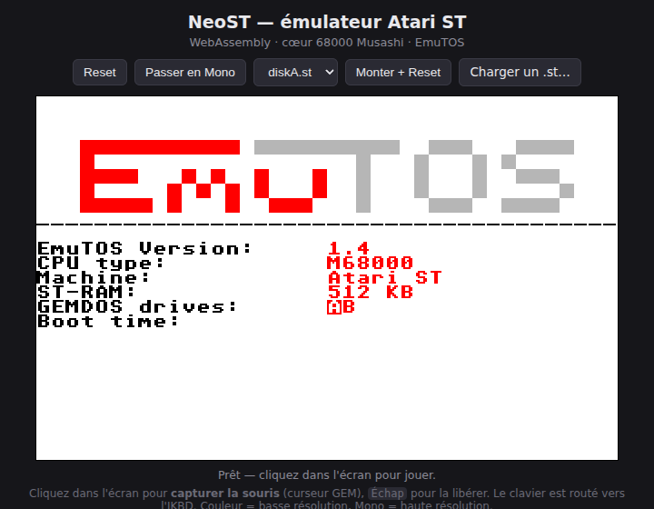

# NeoST

**Un Atari ST que vous pouvez ouvrir, comprendre et bidouiller — puce par puce.**

NeoST est un émulateur Atari ST « boîte à hack » pédagogique : au lieu d'une boîte
noire qui « fait tourner les jeux », c'est une **carte mère transparente**. Chaque
composant (Shifter vidéo, YM2149, MFP 68901, FDC WD1772, MMU/GLUE, blitter…) est
modélisé séparément et **branché sur un `Bus` qui *est* le plan mémoire**, exactement
comme les puces sont câblées sur la vraie carte. On voit la RAM, les registres 68000
et l'état des puces vivre en direct.

> (c) 2026 VERHILLE Arnaud — C++17 · macOS Silicon / Linux · **et dans le navigateur**.

## ▶ Essayer tout de suite (sans rien installer)

**Démo WebAssembly : <https://habib256.github.io/neost/>**

Le même cœur d'émulation, compilé en WASM, tourne dans votre navigateur. L'interface
permet de **tout tester sans recompiler** : choix de la ROM (EmuTOS US/FR, TOS 1.02),
montage de disquettes, bascule couleur/mono, et **upload** de votre propre `.st`.



## Pourquoi NeoST

- 🔬 **Transparence matérielle totale** — le `Bus` route chaque accès vers la bonne
  puce ; rien n'est caché. Idéal pour *apprendre* comment un ST fonctionne vraiment.
- 🧩 **Modélisation puce par puce, fidèle Hatari** — le comportement matériel est
  porté registre par registre depuis [Hatari](https://hatari.tuxfamily.org/) et MAME,
  les références de l'émulation Atari. Les vraies **cartouches de diagnostic Field
  Service** (ST / STE / MegaSTE) passent leur batterie de tests internes sans erreur.
- 🖥️ **4 profils machine** — ST, Mega ST, STE, Mega STE, choisis avant le boot, avec
  le matériel optionnel correctement présent/absent selon le modèle.
- ⚙️ **Cœur 68000 cycle-exact** — [Moira](https://github.com/dirkwhoffmann/Moira)
  (timing inter-instructions, IPL échantillonné au cycle, contention de bus).
- 🐞 **Débogueur intégré** — visualiseur hexa de la RAM et registres 68000 en direct
  (Dear ImGui), plus un **mode headless déterministe** qui produit des traces façon
  MAME (l'arme secrète pour diagnostiquer un jeu qui bloque).
- 🔊 **Son complet** — YM2149 (3 voies + bruit + enveloppe), son DMA STE, filtres
  Microwire/LMC1992, et même les **bruits mécaniques du lecteur** de disquette.
- 🌐 **Multi-plateforme** — macOS Silicon, Linux, et WebAssembly. Une seule base de code.

## Démarrage rapide

### Dépendances

- **GLFW3** — `brew install glfw` (macOS) / `pacman -S glfw` (CachyOS/Arch)
- **OpenGL** — fourni par le système (framework Apple / Mesa)
- Sous-modules : `extern/moira` (cœur 68000), `extern/imgui`, `extern/miniaudio`

```sh
git submodule update --init --recursive
# Aucune étape de génération : Moira se compile tel quel (C++20).
```

### Build & run

```sh
cmake -B build -DCMAKE_BUILD_TYPE=Release
cmake --build build -j                          # cibles : neost, neost-headless, neost_core
./build/neost                                   # auto : dernier ROM (neost.cfg) ou EmuTOS US
./build/neost roms/etos192fr.img disks/diskA.st  # ROM + disquette explicites
```

> Les chemins par défaut (`roms/`, `disks/`) sont résolus depuis le répertoire courant
> **et** depuis l'exécutable — `./neost` marche aussi bien depuis la racine que `build/`.

### Contrôles

| Touche     | Action                       |
|------------|------------------------------|
| F12        | Reset physique virtuel       |
| Suppr (DEL)| Libère la capture souris     |

Clic dans l'écran ST = capture de la souris (curseur GEM) ; le clavier est routé vers
l'IKBD. Le GUI ajoute un menu **Machine** (modèle, mémoire, cœur CPU) et une
**Disk Library** (monter/éjecter à chaud).

## ROM : EmuTOS par défaut (libre)

Les TOS Atari d'origine sont propriétaires et **ne sont pas redistribués** ici. NeoST
utilise par défaut **[EmuTOS](https://emutos.sourceforge.io/)** (GPL), dans `roms/` :

```
roms/etos192fr.img   EmuTOS 192 Ko, français  (mappé à $FC0000, par défaut)
roms/etos192us.img   EmuTOS 192 Ko, US
```

## Disquettes

Le lecteur A monte une image `.st` (dump de secteurs brut ; `.msa` aussi supporté).
Une image FAT12 720 Ko de démonstration est fournie dans `disks/diskA.st`. Outils :

```sh
python3 tools/make_floppy.py                 # (re)génère disks/diskA.st (FAT12 de test)
python3 tools/fetch_disk.py <url planetemu>  # télécharge une disquette de test (scrapling)
```

> ⚠ `fetch_disk.py` n'est à utiliser que pour des logiciels auxquels vous avez droit
> (domaine public, freeware, démos), afin de tester l'émulateur.

## Build WebAssembly (local)

Nécessite l'[emsdk](https://emscripten.org/docs/getting_started/downloads.html) activé
(`source .../emsdk_env.sh`). La cible `neost-web` écrit dans `wasm/` :

```sh
emcmake cmake -B build-web -DCMAKE_BUILD_TYPE=Release
cmake --build build-web -j --target neost-web    # → wasm/index.{html,js,wasm,data}
python3 -m http.server -d wasm 8000              # puis ouvrir http://localhost:8000/
```

`-DNEOST_WEB_FREE_ONLY=ON` réduit la build aux seuls contenus libres (EmuTOS + `diskA`).
Le déploiement GitHub Pages est automatisé par `.github/workflows/deploy-web.yml`.

## Documentation

| Fichier                        | Contenu                                                       |
|--------------------------------|--------------------------------------------------------------|
| [`DEV.md`](DEV.md)             | Architecture détaillée, modèle d'horloge, débogage headless, pièges matériels, extension d'un composant. |
| [`CHANGELOG.md`](CHANGELOG.md) | Tout ce qui est déjà implémenté et validé.                    |
| [`TODO.md`](TODO.md)           | Feuille de route — ce qui reste à faire (fidélité Hatari, MegaSTE, précision cycle). |
| [`CLAUDE.md`](CLAUDE.md)       | Hub d'orientation (méthode de travail, sources de vérité).    |

## État

EmuTOS (FR/US) et TOS 1.02 bootent (green desktop, disquette, souris, son). Les trois
cartouches de diagnostic atteignent leur menu et passent leurs tests internes.
**Arkanoid** se lance et affiche son écran-titre. Les images **Spectrum 512**
(palette intra-ligne, jusqu'à 512 couleurs) sont rendues **100 % pixel-identiques à
l'oracle Hatari**, sans flicker. Le grand chantier en cours est la **précision cycle**
(bordures, timing fin des jeux/démos) — voir [`TODO.md`](TODO.md) et
[`docs/CYCLE_ACCURACY.md`](docs/CYCLE_ACCURACY.md).
